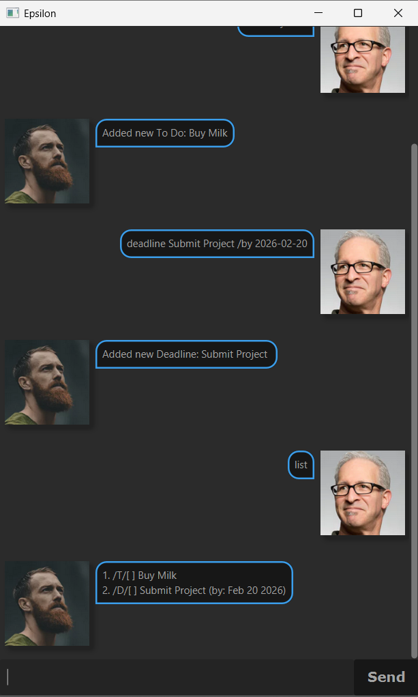

# Epsilon User Guide



Welcome to the User Guide for Epsilon, a Task Tracking Application.

## Adding Tasks: `todo`, `deadline` and `event`

Adds a task to your current list of tasks.
All dates (e.g. DEADLINE, START, END) are to be entered in YYYY-MM-DD format.

Adding a "To Do" task (A Task with no Time Aspect):
Format: `todo TITLE`

Adding a "Deadline" task (A Task with a Deadline):
Format: `deadline TITLE /by DEADLINE`

Adding a "Event" task (A Task with a Start and End date):
Format: `event TITLE /from START /to END`

Examples:
 - `todo Buy Milk`
 - `deadline Submit Project /by 2026-02-20`
 - `event Career Fair /from 2026-06-14 /to 2026-06-18`

## Listing All Tasks: `list`

Prints a list of all current recorded tasks.

Format: `list`

```
expected output
```

## Marking Tasks: `mark`

Marks a specified Task as Completed.

Format: `mark ID`

Example:
 - `mark 2`

```
expected output
```

## Unmarking Tasks: `unmark`

Unmarks a specified Task, that task is now incomplete.

Format: `unmark ID`

Example:
 - `unmark 1`

```
expected output
```

## Deleting Tasks: `delete`

Deletes a specified task from the list.

Format: `delete ID`

Example:
 - `delete 3`

```
expected output
```

## Finding Tasks: `find`

Searches the current list of tasks for tasks that contain a specified string.

Format: `find SEARCH_STRING`

Example:
 - `find Submit`

```
expected output
```

## Show Upcoming Tasks: `upcoming`

Shows all Deadline tasks that are due within a week, as well as Event tasks that start within a week.

Format: `upcoming`

```
expected output
```
